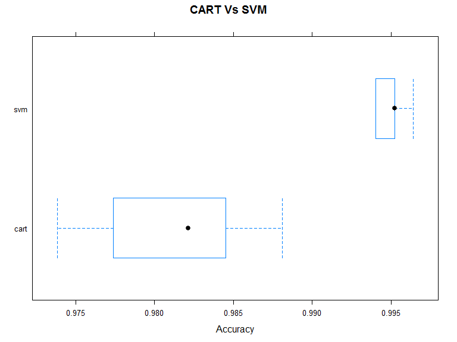

### Special thanks to web archive <http://web.archive.org/> for allwoing to use the datasets

### This report shows the predictive analysis using Machine learning algorithm for the 20 cases in the excercise data

### Data is collected from accelerometers on the belt, forearm, arm, and dumbell of 6 participants

### Load the training and test data

-   Note: Reduced data set used as the PC where this report ran is
    having less computing power \*

<!-- -->

    fpath <- "F:/c8proj/"
      trainfname <- "pml-training.csv"
      setwd(fpath)
      testfname <- "pml-testing.csv"
      
      if (!file.exists(trainfname)){
      download.file("https://d396qusza40orc.cloudfront.net/predmachlearn/pml-training.csv",trainfname)
      }
      
      if (!file.exists(testfname)){
      download.file("https://d396qusza40orc.cloudfront.net/predmachlearn/pml-testing.csv",testfname)
        }
      
      traindset <- read.csv("pml-training.csv",header = TRUE , nrows = 6000 ,na.strings = c("NA", ""))
      testdset <- read.csv("pml-testing.csv",header = TRUE,na.strings = c("NA", ""))

### Load all required libraries Caret, rpart , random forest

    library(caret)

    ## Warning: package 'caret' was built under R version 3.4.4

    ## Loading required package: lattice

    ## Loading required package: ggplot2

    ## Warning: package 'ggplot2' was built under R version 3.4.1

    library(rpart)

    ## Warning: package 'rpart' was built under R version 3.4.4

    library(randomForest)

    ## Warning: package 'randomForest' was built under R version 3.4.4

    ## randomForest 4.6-14

    ## Type rfNews() to see new features/changes/bug fixes.

    ## 
    ## Attaching package: 'randomForest'

    ## The following object is masked from 'package:ggplot2':
    ## 
    ##     margin

    library(repmis)

    ## Warning: package 'repmis' was built under R version 3.4.4

### Clean and split the data into test and validation partitions

    traindset <- traindset[, -c(1:7)]
    testdset <- testdset[, -c(1:7)]
    traindset <- traindset[, colSums(is.na(traindset)) == 0]
    testdset <- testdset[, colSums(is.na(testdset)) == 0]
    set.seed(7826) 
    partn <- createDataPartition(traindset$classe , p=0.7 ,list=FALSE)
    trainpart <- traindset[partn, ]
    validpart <- traindset[-partn, ] 

### Create models using the training data for determining the accuracy

    set.seed(7826) 
    control <- trainControl(method="cv", number=5)
    fit_rpart <- train(classe~., data=trainpart, method="rpart", metric ="Accuracy",trControl=control)
    fit_svm <- train(classe~., data=trainpart, method="svmRadial", metric ="Accuracy",trControl=control)

### Select the best model

    set.seed(7826) 
    results <- resamples(list(cart=fit_rpart, svm=fit_svm))
    summary(results)

    ## 
    ## Call:
    ## summary.resamples(object = results)
    ## 
    ## Models: cart, svm 
    ## Number of resamples: 5 
    ## 
    ## Accuracy 
    ##           Min.   1st Qu.    Median      Mean   3rd Qu.      Max. NA's
    ## cart 0.9738095 0.9773810 0.9821429 0.9811905 0.9845238 0.9880952    0
    ## svm  0.9940405 0.9940476 0.9952381 0.9949997 0.9952438 0.9964286    0
    ## 
    ## Kappa 
    ##           Min.   1st Qu.    Median      Mean   3rd Qu.      Max. NA's
    ## cart 0.7665547 0.8104873 0.8477746 0.8384511 0.8680713 0.8993675    0
    ## svm  0.9517711 0.9533292 0.9623614 0.9603648 0.9623646 0.9719975    0

    summary(diff(results))

    ## 
    ## Call:
    ## summary.diff.resamples(object = diff(results))
    ## 
    ## p-value adjustment: bonferroni 
    ## Upper diagonal: estimates of the difference
    ## Lower diagonal: p-value for H0: difference = 0
    ## 
    ## Accuracy 
    ##      cart     svm     
    ## cart          -0.01381
    ## svm  0.008185         
    ## 
    ## Kappa 
    ##      cart     svm    
    ## cart          -0.1219
    ## svm  0.008447

    bwplot(results,metric="Accuracy",main="CART Vs SVM")

    ##Based on the results SVM is the best model to  be used##
    predict_val <- predict(fit_svm, validpart)
    confusionMatrix(predict_val, validpart$classe)

    ## Confusion Matrix and Statistics
    ## 
    ##           Reference
    ## Prediction    A    B
    ##          A 1673    9
    ##          B    1  117
    ##                                           
    ##                Accuracy : 0.9944          
    ##                  95% CI : (0.9898, 0.9973)
    ##     No Information Rate : 0.93            
    ##     P-Value [Acc > NIR] : < 2e-16         
    ##                                           
    ##                   Kappa : 0.956           
    ##  Mcnemar's Test P-Value : 0.02686         
    ##                                           
    ##             Sensitivity : 0.9994          
    ##             Specificity : 0.9286          
    ##          Pos Pred Value : 0.9946          
    ##          Neg Pred Value : 0.9915          
    ##              Prevalence : 0.9300          
    ##          Detection Rate : 0.9294          
    ##    Detection Prevalence : 0.9344          
    ##       Balanced Accuracy : 0.9640          
    ##                                           
    ##        'Positive' Class : A               
    ## 

### Now use SVM model to predict the test data set

    predict_test <- predict(fit_svm, testdset)
    print(predict_test)

    ##  [1] B A A A A A A A A A A A A A A A A A B A
    ## Levels: A B

*End of Report*
